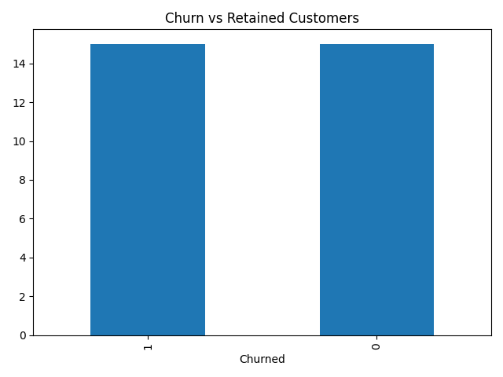
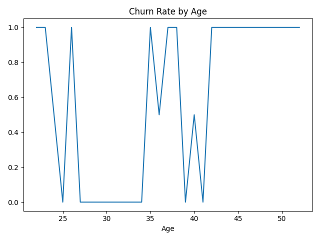
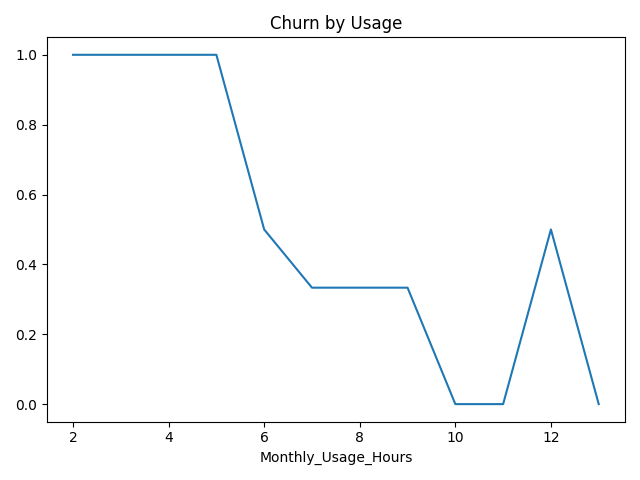
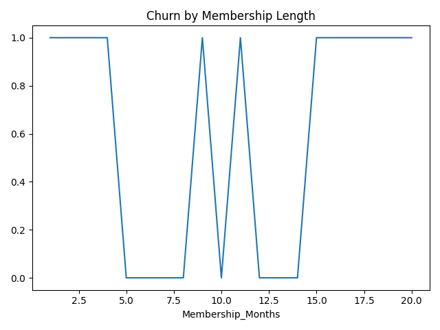

# Customer Churn Analysis

## Project Demo

This project analyzes customer churn data to identify behavioral patterns, retention trends, and risk factors associated with customer cancellations.

It demonstrates an end-to-end workflow:
**data creation → customer analysis → churn analysis → visualization → business recommendations**

---

## Project Overview

This project simulates a customer retention analysis for a subscription-based business. The goal is to identify which customers are more likely to churn and uncover trends that can help improve retention.

---

## Business Problem

Many subscription-based businesses struggle to retain customers.

This project helps answer:

- What percentage of customers churn?
- Are low-usage customers more likely to leave?
- Does membership length impact retention?
- Which customer groups are at highest risk of churn?
- What actions could improve retention?

---

## Tools Used

- Python
- Pandas
- Matplotlib
- VS Code
- Git & GitHub

---

## Dataset

A fictional dataset was created containing:

- Customer ID
- Age
- Monthly Usage Hours
- Membership Length
- Subscription Type
- Churn Status

---

## Analysis Process

1. Created customer churn dataset
2. Calculated churn metrics
3. Compared:
   - Customer usage
   - Membership length
   - Retained vs churned customers
4. Built visualizations for churn trends
5. Generated business insights and recommendations

---

## Key Findings

- Customers with lower usage were more likely to churn
- Shorter membership lengths correlated with higher churn
- Long-term members had stronger retention
- Certain subscription groups showed higher churn risk

---

## Business Insights

- Increasing engagement could reduce churn
- New customers are more likely to cancel early
- Retention programs should target low-usage customers
- Long-term customers provide stronger lifetime value

---

## How a Business Could Use This

A business could use this analysis to:

- Identify at-risk customers
- Improve customer retention strategies
- Reduce customer acquisition replacement costs
- Create targeted promotions and engagement campaigns
- Improve long-term customer value

---

## Visualizations

### Churn vs Retained Customers


### Churn Rate by Age


### Churn by Usage


### Churn by Membership Length


---

## How to Run This Project

1. Clone the repository:

```bash
git clone https://github.com/gwademo21/customer-churn-analysis.git
pip install -r requirements.txt
python churn_analysis.py